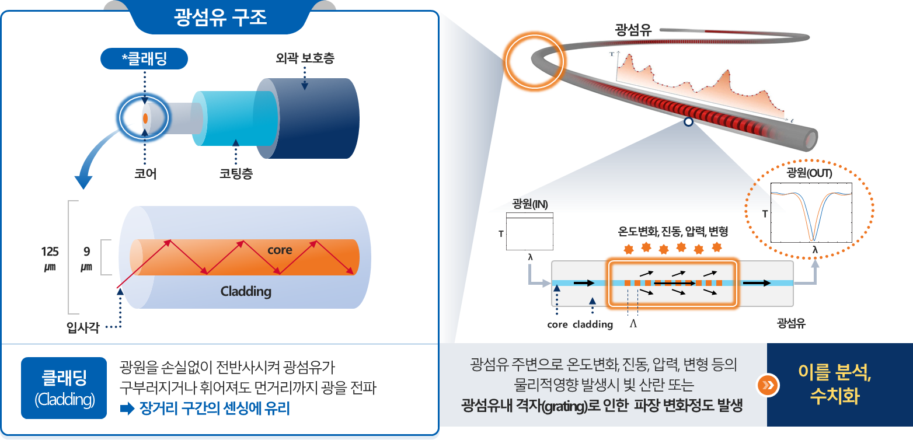
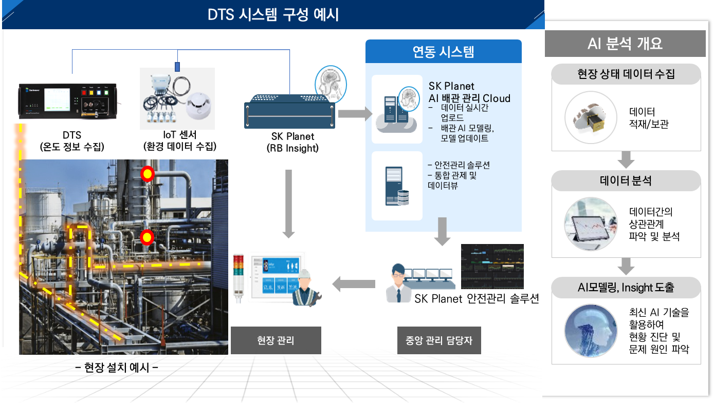
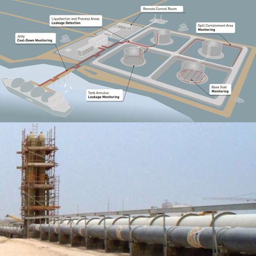
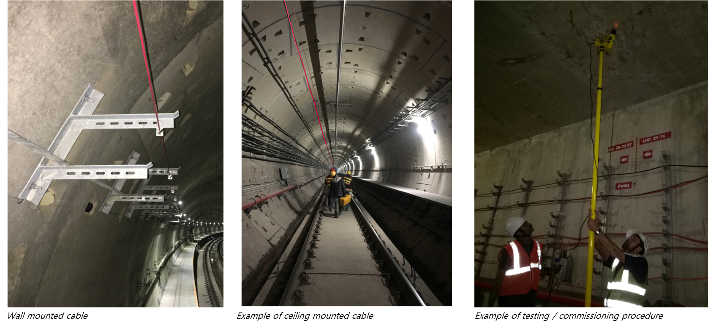

DTS(Distributed Temperature Sensor)는 광섬유 센서를 활용하여 최대 50Km 길이의 구간을 미터 간격으로 온도를 측정하는 기술입니다.  
이러한 DTS 기술에 AI를 접목하면 화학, 정유, 제조, 철도, 항만, 펜스, 터널 등의 분야에서 안전관리를 목적으로 적용할 수 있습니다.   
SK Planet은 DTS 기술에 자체 개발한 AI를 접목하여 사업화하고 있으며, 이와 관련된 몇 가지 상용 사례를 소개하고자 합니다.

## DTS 기술 개요
DTS(분산 온도 센서) 기술은 광섬유 케이블이 설치된 구간에서 온도를 실시간으로 측정할 수 있습니다. 중앙 서버는 이러한 온도 데이터를 수집하고 목적에 맞게 처리합니다.   
DTS 는 광섬유 케이블의 시작 지점에서 끝 지점까지 광학 신호를 이용하여 온도를 측정합니다. 이때 광섬유 케이블 자체가 센서로 작용하며, 일반적인 전기 온도 센서보다 더 넓은 온도 범위와 더 높은 정확도로 온도를 측정합니다.   

DTS의 작동 원리는 광섬유에 레이저 빛을 주입하고, 광섬유의 굴절률을 이용하여 주변 온도 변화에 따른 빛의 속도 변화를 감지하는 것입니다. 빛의 속도는 온도와 관련되기 때문에 광케이블 주변의 온도 변화가 빛의 속도에 영향을 미치게 됩니다. 이러한 정보가 광섬유 케이블을 따라 관리 시스템으로 전송됩니다. 관리 시스템은 이러한 데이터를 수집하여 가공하면, 실시간으로 광케이블 주변의 온도 변화를 알 수 있습니다.

DTS 기술을 활용한 주요 응용 분야는 오일 파이프 라인, 가스 파이프 라인, 전력 케이블, 지열 시스템 등의 배관이나 선로에 광 케이블을 설치하여 상태를 모니터링하는데 사용됩니다. 이 외에도 환경 모니터링, 해양 과학, 지질 조사,  화재 감지, 군사, 물리 보안 등에도 활용 가능합니다.   

시스템 구조를 보면 DTS 인트로게이터 , 광케이블 센서, SK Planet RB Insight , AI Cloud 모델로 구성됩니다. DTS 인트로 게이터는  최대 50km 까지 실시간 온도 데이터를 분석하는 장비입니다. 광케이블 센서는 기존의 광통신 케이블과 같은 스펙의 제품이며, 외부 잡음의 영향을 줄이기 위해 쉴드를 사용해서 안전성을 확보합니다. RB Insight는 DTS 인트로게이터에서 보내는 Low Data를 기반으로 Anomaly Detection을 수행합니다. AI Cloud는 AI 모델링과 모델 업데이트를 담당하며, 주기적으로 RB Insight와 연동됩니다. 

## DTS 기술 적용 사례
DTS 기술이 적용되는 대표적인 산업분야는 화학, 정유, 제조, 철도, 항만, 펜스, 터널 등으로 주된 목적은 안전관리입니다.     

> * 파이프 라인 누출 감지: 오일이나 가스의 Delivery 파이프 라인에서 Leak 누출을 감지합니다. 실시간 Leak 감지로 사고 방지에 도움이 됩니다.
> * 터널 및 지하 공동구 화재 감지: 터널이나 지하 공동구에서 장거리 구간의 화재를 감지합니다. 실시간 화재 감지로 사고 방지에 도움이 됩니다.
> * 반응기(Reactor), 용광로(Furnace) 내화 재료의 안전 모니터링: 고열 구조물에 대한 열감지를 합니다. 특정 부위의 이상 탐지를 통한 사고 방지에 도움이 됩니다.

### 파이프 라인 누출 감지 
오일이나 가스 플랜트 단지는 수만평에서 수십만평 규모이며, 이러한 넓은 지역에 복잡한 파이프 라인이 설치되어 있습니다.   
파이프 라인 누출 감지를 위하여 기존 방식인 육안 검사나 스팟 단위 전수 검사는  한 달 이상 소요되는데, DTS 기술을 활용하면 실시간으로  전수 검사를 할 수 있습니다. 또한 이러한 플랜트에 있는 특정 장치나 시스템이 안정성 평가를 위하여 온도 정보가 필요하며, 이러한 정보는 관리 시스템에 전송됩니다.

* 오일이나 가스 플랜드 단지의 Tank, Base, Pipe Line, Jelly 등의 인프라에 적용하여 실시간으로 온도를 탐지합니다.
* AI 기술을 이용하여 DTS의 데이터를 기반으로  Feature Eng, Model Dev를 통하여 리크방지 Anomaly Detecion을 구현합니다.
* Anomaly Detecion을 통하여 Leak 및 온도 이상을 실시간으로 감지하여 오일이나 가스 플랜트의 안전 관리에 도움이 됩니다.

### 터널 및 지하공동구 화재 감지
터널이나 지하공동구는 장거리의 인프라로 길게는 수 km로 구성됩니다. 여기에는 기존의 스팟 단위의 화재 감지 시스템이 설치가 되어 있지만, 모든 화재를 탐지하기 어렵습니다.   
DTS 기술은 미터 단위로 온도를 감지할 수 있습니다. 이러한 기능을 수십 km까지 확대 적용할 수 있어서 터널이나 지하공동구에 가장 적합한 기술로 알려져 있습니다.  

* 터널이나 지하공동구와 같은 인프라에 적용할 수 있으며, 실시간으로 온도를 탐지합니다.
* AI 기술을 이용하여 DTS 데이터를 기반으로  Feature Eng, Model Dev를 통하여 화재 방지 Anomaly Detecion을 구현합니다.
* 특징 추출: 전처리된 데이터로부터 특징을 추출합니다. 초분광 데이터는 많은 수의 밴드(파장 대역)를 가지고 있어서 특징 추출이 중요합니다. 통계적인 방법이나 주성분 분석(PCA) 등을 사용하여 특징을 선택하거나 추출합니다.
* Anomaly Detecion을 활용한 온도 이상 변화량을 기반으로 실시간으로 화재를 감지하여 안전 유지에 도움이 됩니다.

### 반응기(Reactor), 용광로(Furnace) 내화 재료의 안전 모니터링
반응기(Reactor), 용광로(Furnace)의 내화 재료는 초고열 특성을 가지고 있어서 일반 센서나 열화상 카메라로 모든 스팟의 온도를 측정하기 어렵습니다. 여기에 DTS와  AI 모델을 적용하면, 실시간으로 정확한 온도를 측정할 수 있어서 관련 장치를 안전하게 운용할 수 있습니다. 

* 초고열 시설에 DTS 특수 광센서를 이용하여 실시간으로 부위별 온도를 감지합니다.  
* AI 기술과 DTS 데이터를 기반으로  Feature Eng, Model Dev를 통하여 온도 이상 감지  Anomaly Detecion을 구현합니다.
* Anomaly Detecion을 통하여 부위별 온도 변화량을 활용하여 특수 시설의 안전 유지에 도움이 됩니다.

## 시사점

* 정보 제공: 장거리에 설치된 다양한 시설의 온도 정보를 실시간으로 제공합니다. 이 정보를 활용하여 화재 감지나 안전 모니터링이 가능하고 AI 알고리즘을 결합하여 더 정확하고 다양한 상태 정보를 얻을 수 있습니다.
* 안전 유지: AI 알고리즘을 활용하여 대규모 시설의  안정성을 유지하고, 잠재적인 문제를 예방할 수 있습니다. 국가 시설물, 산업단지, 회사 등에 설치된 관련 장비나 시설의 경쟁력을 강화할 수 있습니다.
* 친환경 기술: DTS 시스템을 적용하면 환경 저해 요소가 없으며, 유해 전파나 유해 물질을 발생시키지 않습니다. 

### 용어 설명
* DTS(Distributed Temperature Sensor): 분산형 온도 광센서는 라만대역의 광신호 반사파를 이용한 온도 측정 시스템입니다. 
* Anomaly Detecion: 이상 탐지 대부분의 데이터가 보이는 주류 경향을 벗어난 희귀 항목, 사건, 관측값을 식별하는 기술입니다.