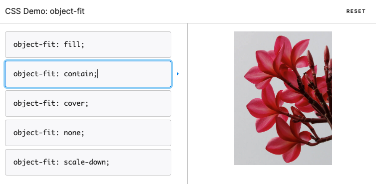
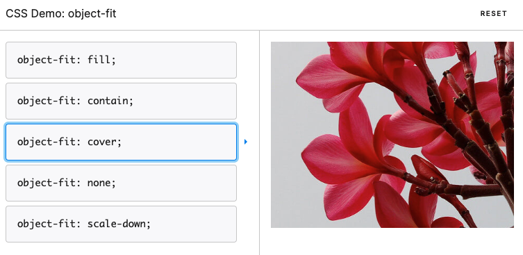
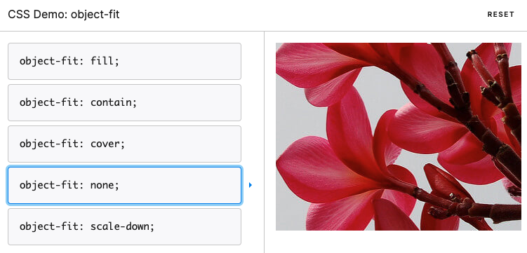
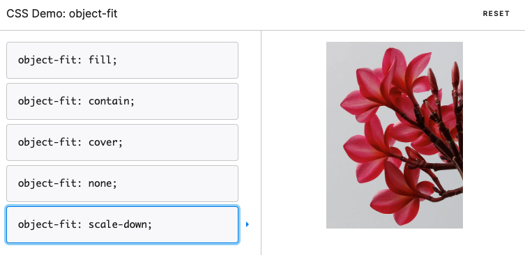

대부분의 동영상 어플리케이션에서 구현되어 있는 것처럼, V 컬러링에서도 동영상 렌더링 시 재생 전 회색 (또는 하얀) 화면의 노출을 방지하고자 배경에 미리 썸네일을 깔아 두는 구현 방식을 사용하고 있습니다. 그런데 작년 7월 iOS가 15 버전으로 업데이트되면서 (베타 버전), 이상하게도 썸네일에서 비디오 재생으로 넘어가는 그 찰나에 화면이 깜박거리는 현상이 발생하기 시작했습니다.

한 화면에 한 영상만 로드되는, 특히 홈과 같이 크기가 작은 영상인 경우 별로 티가 나지 않았지만 플레이어처럼 전체 화면을 빠르게 스와이프하면서 영상이 바뀌는 경우에는 계속 깜박임이 발생하여 눈이 아주 피로했습니다.


(왼쪽이 홈 화면, 오른쪽이 아래위로 스와이프하면서 전체 화면으로 영상을 볼 수 있는 플레이어 화면입니다.)

V 컬러링은 기본적으로 모든 영상이 자동 재생되고 있습니다. 하지만 iOS에서는 사용자가 액션을 취하기 전에는 음소거 재생이 원칙이기 때문에, 음소거 모드를 해제하고 스와이프를 했을 때 다음 영상에서 소리가 재생되도록 하기 위해 안드로이드와 약간 다른 렌더링 방식을 사용합니다.

처음 이슈를 발견했을 때 저는 이러한 구조적 차이점에 원인이 있다고 판단해서, 안드로이드와 iOS의 서로 다른 구현 방식을 분석했습니다. 구현되어 있는 구조를 간단히 설명하자면, 안드로이드는 스와이퍼 내부에 비디오를 컨트롤하는 컴포넌트를 넣어 현재 보고 있는 영상 직전/직후의 썸네일을 미리 받아와서 스와이프를 할 때 보다 빠르게 화면에 렌더링을 하는 반면, iOS는 안드로이드와 같은 구현 방식을 사용하면 재생 시 자동으로 음소거가 되어 버리는 문제점이 있기 때문에 비디오를 컨트롤하는 영역을 따로 분리해서 스와이프가 된 이후 하나씩 영상을 재생하며 소리를 켜는 방식을 사용하고 있습니다. 그래서 iOS를 안드로이드와 동일한 방식으로 구현해 보기도 하고, 재생되는 시점의 데이터를 하나 하나 확인해 보며 원인을 파악해 보려고 애썼지만 어떤 방법으로도 해결이 되지 않았습니다.

여러 가지 방법을 시도해 보다가 slide change event가 일어나는 시점을 살펴보았습니다.

사용자에게 아무것도 렌더링되지 않은 화면을 보여주지 않기 위해 현재 스와이핑이 되는 과정, 즉 slide change event가 일어나는 시점에도 썸네일을 배경으로 보여주고 있었는데요,

이미지에서 동영상으로 전환이 되는 시점에 리페인팅을 하는 과정이 잘 처리되지 못하는 것이 아닌가 하는 생각이 들어, 스와이핑 중일 때는 썸네일을 제거해 보기로 하였습니다.
그랬더니 배경이 사라지면서 조금 덜 버벅거리는 느낌은 있었지만, 여전히 비디오가 재생되는 시점에서는 깜박임이 발생하였습니다.

이번에는 비디오 로드의 초기 상태값을 변경해 보기로 하였습니다. iOS의 경우 처음에 로딩 상태를 나타내는 값이 false로 되어 있고, 비디오의 `onLoadedData` 속성에서 해당 상태값을 true로 바꿔주며, slide change event 발생 시 다시 로딩 상태를 false로 바꿔 주고 있습니다.

### onLoadedData

`video` 태그가 완전히 로드될 때 javascript를 실행하는 이벤트 요소

```html
<video onLoadedData="{setLoaded}" />
```

(참고) 비디오 로드 순서 (출처 : w3cschool)

> 1. onloadstart
> 2. ondurationchange
> 3. onloadedmetadata
> 4. onloadeddata
> 5. onprogress
> 6. oncanplay
> 7. oncanplaythrough

그래서 로딩 상태의 초기값을 true로 변경해 주었더니, 일단은 깜박거리는 현상이 사라지는 것을 확인할 수 있었습니다.

하지만 이렇게 썸네일을 보여주는 과정을 생략하니 비디오가 재생되기 전에는 검은 화면이 노출되어, 깜박이는 현상은 사라졌지만 뭔가 화면이 굉장히 느리게 렌더링되는 느낌을 지울 수가 없었습니다.

특히 너비가 더 긴 가로형 영상인 경우 원래부터 위아래가 검은색 배경이라 크게 느리다는 느낌이 없었지만, 길이가 더 긴 세로형 영상의 경우 전체 화면이라 시각적으로 주는 효과가 더 크게 느껴졌습니다.

문제의 현상이 썸네일에서 동영상으로 전환되는 과정에서 깜박거리는 것으로 보였기 때문에 이번에는 썸네일의 위치 및 보여주는 시점을 변경해 보기로 하였습니다.
우선 원래 스와이퍼 안에 있던 껍데기 컴포넌트에서 공통으로 사용하던 썸네일을 스와이퍼 외부에 따로 빠져 있는 iOS 비디오 영역으로 이동시켜 보았습니다.
그 이유는 로딩 상태 값이 변경될 때마다 화면이 다시 그려지는데,
이미지와 비디오가 같은 노드에 위치하고 있으면 부모 컴포넌트를 거치지 않고 자식 컴포넌트에서 렌더링을 한 번만 수행하면 리페인트 과정이 줄어들기 때문입니다.

그래서 이미지 위치를 옮긴 후 비디오의 로드 상태값을 다시 원복시켜, 로드가 되지 않았을 때는 썸네일을, 로드가 된 이후에는 비디오를 보여주도록 변경해 보았더니 여전히 깜박거리는 현상은 있었지만 이전보다는 훨씬 개선이 된 느낌이었습니다.
어느 부분이 개선이 된 걸까 테스트를 해보다 보니, 세로형 영상에서는 개선이 되지 않았지만 가로형 영상에서는 깜박이는 현상이 바로 해결되고 아주 매끄럽게 화면 전환이 일어나는 것을 확인할 수 있었습니다.

그래서 데이터를 기준으로 가로형 영상과 세로형 영상을 구분하여 가로형은 기존과 같이 썸네일 로드 후 비디오를 재생하도록 처리하였고,
세로형은 썸네일을 제거하고 비디오를 바로 로드하도록 처리하였습니다.
이렇게 했더니 가로형 영상에서는 깜박이는 현상은 사라지면서도 썸네일이 아예 보이지 않을 때보다는 훨씬 빠른 것 같은 느낌을 받을 수 있었습니다.

그로부터 한참 후 시간적 여유가 좀 생겼을 때 여전히 어딘가 찜찜했던 마음의 빚을 해결하고자 문제를 다시 한번 들여다 보았습니다. 그리고 자바스크립트 영역에서는 이제 가능한 모든 방법을 사용했다고 판단했기 때문에 스타일 속성을 분석해 보아야겠다는 생각으로 착안점을 바꾸게 되었습니다. 그러면서 `object-fit` 속성에 대해 자세히 조사를 해 보게 됩니다.

### object-fit이란?

css의 `object-fit` 속성이란, 요소의 크기에 맞게 `img` 태그와 `video` 태그의 크기를 조정하는 방법으로 사용되는 속성입니다. 기본적인 속성 값은 다음과 같습니다.

> - **fill** : 기본값이며 요소의 크기에 맞게 꽉 채워서 보여줍니다. 크기가 늘어나거나 찌그러집니다.
> - **contain** : 요소의 가로/세로에 맞춰 크기가 조정되고, 비율은 고정입니다.
> - **cover** : 요소의 가로/세로에 맞춰 크기가 조정되고, 비율은 고정입니다. 가득 채울 때까지 확대됩니다.
> - **none**: 원본 사이즈로 처리됩니다.
> - **scale-down** : none과 contain 중 대체 콘텐츠의 크기가 더 작아지는 값을 선택합니다.







(출처 : [object-fit] https://developer.mozilla.org/ko/docs/Web/CSS/object-fit)

위에서 언급했듯 가로형은 문제가 없었는데 세로형에서 이슈가 되었던 원인은, 최초에 css가 가로형 영상의 경우 `object-fit`은 contain으로, 세로형 영상인 경우 cover로 세팅되어 있었기 때문이었습니다. 세로 모드만 지원하는 V 컬러링에서는 세로가 더 긴 일반적인 스마트폰을 기준으로 영상을 보여주기 때문에, 요건 자체가 가로가 더 긴 가로형 영상은 너비에 맞춰 높이는 무시하는 반면 세로가 더 긴 세로형 영상은 높이에 맞춰 세팅하면서 가로를 100%로 늘려 full 영상으로 보여주도록 되어 있었습니다. 그래서 `object-fit`이 contain으로 통일되지 않고 세로형은 cover로 분기가 되어 있었던 것이죠.

이에 `object-fit`이 cover일 경우 iOS 15에서 썸네일과 영상의 변환 과정이 자연스럽지 못하다는 추측을 통해, 비디오의 `object-fit`의 초기값을 contain으로 바꿔 보았습니다. 역시나 예상대로 가로형과 같이 깜박거리는 현상이 사라지고 매끄럽게 영상으로 전환 재생이 되더군요. 따라서 iOS 15에서는 `object-fit`의 cover, fill을 제대로 처리하지 못한다고 스스로 결론을 내었습니다.

하지만 이렇게 해도 여전히 문제는 남았습니다. 세로형을 contain으로 해 버리면 풀 화면을 채워야 한다는 기획요건에 부합하지 못하고 너비가 양쪽으로 남게 되는 현상이 발생했기 때문입니다.

고심에 고심을 거듭하다가 순간, 초기 값은 contain으로 하되 비디오가 로드되는 시점에 `object-fit` 속성을 cover로 변경하면 어떨까? 하는 아이디어가 반짝 하고 떠올랐습니다.
결과는? 대성공이었습니다! 😎

최종적으로 정리한 내용은 다음과 같습니다.

```javascript
const objectFit: "contain" | "cover" = useMemo(
  () => (direction === "HORIZONTAL" ? "contain" : "cover"),
  [direction]
);

const loadedStyle = useMemo(
  () => (loaded ? { objectFit } : { display: "none" }),
  [loaded]
);

{
  !loaded && ;
}
<video
  className="contain"
  style={loadedStyle}
  onLoadedData={() => setLoaded(true)}
/>;
```

(불필요한 속성은 제거하였습니다.)

### 마무리

로딩이 되기 전에는 이미지를 풀 화면으로 보여주고, (이미지에는 `object-fit: cover` 속성이 적용되어 있습니다.) 비디오의 `object-fit` 초기 값은 contain으로 세팅하되 로딩(재생)이 된 시점에 cover로 변경하면 됩니다. 아직 완전한 해결책이라고 단정지을 수는 없겠지만 우선 iOS 15에서 발생하던 깜박임, 그리고 최근에 iOS 15.5에서 대두되던 `object-fit`의 문제(fill일 경우 잠깐 비디오가 contain처럼 보였다가 늘어나는 현상)도 함께 해결된 것으로 보아 위 방법이 최선이라는 결론을 내리게 되었습니다.

접근하는 방법을 찾는 데 굉장히 시간이 많이 소요되었지만 개인적으로 많은 것을 배울 수 있었던 경험이라 생각합니다. 😃

(+) 추가 이슈

iOS 16 버전이 업데이트되면서 잘 되던 방식에 또다시 문제가 생겼습니다. 15 버전으로 처음 업데이트 되었을 때처럼 비디오가 깜박거리기 시작한 것이죠.

다행히 이번에는 문제의 원인을 잘 알고 있었고, 비디오의 구조 또한 완전히 파악하고 있었기 때문에 접근 방법을 쉽게 찾을 수 있었습니다.

우선 깜박거리는 현상을 제거하기 위해 기존에 `display: none`으로 처리하던 부분을 `visibility: hidden`으로 변경하였습니다. 그 이유는 `display` 속성의 경우 그 값에 따라 `block`인 경우 DOM에 영역 자체가 생겨나고 `none`인 경우 사라지기 때문에, 값이 변경될 때마다 높이값을 새로 계산하는 리플로우 과정이 발생하므로 성능에 좋지 않은 영향을 미치기 때문입니다. 반면 `visibility` 속성을 사용하면 영역은 미리 잡아 놓되 값에 따라 노출, 숨김 처리만 되기 때문에 리플로우 과정을 줄일 수 있습니다.

역시나 예상대로 깜박이는 현상은 사라지고, 대신 15.5에서 발생하던 것과 같이 사이즈의 너비가 줄었다가 확대되는 모습이 두드러졌습니다. 기존에 비디오 로드 전 `object-fit`의 값을 `contain`으로 잡아 놓았다가 비디오 로드 후 `cover`로 변경했던 꼼수가 더 이상 먹히지 않는 모습이었죠.

우선 썸네일과 비디오의 `object-fit` 값을 모두 `cover`에서 `contain`으로 변경해 보았습니다. 그랬더니 역시 아주 매끄럽게 화면 전환이 일어나는 모습을 확인할 수 있었습니다. 역시나 iOS 16 버전에서도 `cover` 속성을 처리하지 못하는 것을 확신할 수 있었습니다. (더욱 안좋은 방향으로)

절망의 삽질 끝에 혹시나 하는 마음으로 `cover`를 `fill`로 변경해 보았습니다. `fill`은 `cover`와 달리 원본 이미지의 비율은 유지되지 않지만 화면을 가득 채우는 효과는 `cover`와 동일합니다. 어차피 V 컬러링은 정해진 비율의 동영상을 업로드하기 때문에 사실 `fill`이나 `cover`나 그닥 시각적인 차이점은 없습니다. 설레는 마음으로 플레이어에 진입해 보았더니 놀랍게도 전혀 위화감 없이 현상이 해결된 모습을 확인할 수 있었습니다!

아직은 제 아이폰 12 미니에서만 테스트해보았지만 다른 단말에서 추가적으로 테스트를 해볼 예정입니다.

```javascript
// 최종 코드
const loadedClassName = useMemo(() => (
	loaded ?
		(direction === 'HORIZONTAL' ? 'landscape' : 'fill') :
		'hidden'),
  [loaded, direction]
);

// 비디오에서 style 속성을 제거하고 클래스로 변경
<video
	className=${loadedClassName}
	style={moving ? { visibility: 'hidden' } : {}}
	...
/>
```

(+) 추가 이슈

출근해서 기존에 문제가 되었던 iOS 15.0.1 버전부터 15.4 버전까지 테스트를 해 보았더니 위 코드가 먹지 않는 현상이 나타났습니다. 그래서 예외적으로 위 버전만 분기 처리하여 기존의 코드를 사용하도록 하였고, 나머지 15 버전 이하나 15.5 이상, 안드로이드 버전은 새로운 코드를 사용하도록 처리하였습니다.

```javascript
const videoClassName = useMemo(() =>
	(isUniqueIOSVersion ? 'landscape' : loadedClassName), [
  isUniqueIOSVersion, loadedClassName
]);

const loadedStyle = useMemo(() =>
	(loaded && !moving ? { objectFit } : { display: 'none' }),
[loaded, moving]);

const movingStyle = useMemo(() =>
	(moving ? { display: 'none' } : {}),
[moving]);

const videoStyle = useMemo(() =>
	(isUniqueIOSVersion ? loadedStyle : movingStyle),
[loadedStyle, movingStyle]);

<video
  ref={videoEl}
  className={`obj-video ${videoClassName}`}
  style={videoStyle}
  ...
/>
```

그리고 기존에 `visibility` 속성으로 변경했던 값을 `display`로 다시 원복시켰습니다. (style 속성 충돌 때문) ⇒ 이 부분은 추후 다시 검토해 볼 예정입니다.

2022년 10월 26일에 작성함.

(+) css 속성 변경

추가적으로 테스트를 해 보니 가끔 스와이핑을 시작하는 시점에 미세하게 썸네일이 깜박거리는 현상이 발견되었습니다. 이에 `display` 속성이 문제가 된 것을 직감하고 다시 해결 방안을 찾기 시작했습니다.

그러던 중 다른 작은 비디오 화면에서 사용하고 있는 `transition` 속성을 사용하면 어떨까 하는 생각이 들었습니다. 플레이어에서는 `CSSTransition` 컴포넌트를 씌우면 `object-fit` 속성이 제대로 작동하지 않는 이슈가 있어서 style에 직접 적용하는 방법을 선택하였습니다.

`transition` 속성은 다음과 같이 사용할 수 있습니다.

```html
div { transition:
<property>
  <duration>
    <timing-function> <delay>; }</delay></timing-function></duration
  ></property
>
```

- transition-property
  - 트랜지션을 적용해야 하는 css 속성의 이름으로, 트랜지션 하는 동안 여기에 명시된 속성만 움직입니다.
- transition-duration
  - 트랜지션이 일어나는 지속 시간을 명시합니다.
- transition-timing-function
  - 속성의 중간값을 계산하는 방법을 정의합니다. `ease`, `linear`, `step-end`, `steps` 등의 속성이 있습니다.
- transition-delay
  - 속성이 변한 시점과 트랜지션이 실제로 시작하는 사이에 기다리는 시간을 정의합니다.

하지만 `display` 속성과 `visibility` 속성은 모두 `transition` 기능을 사용할 수 없다는 사실을 알게 되었습니다. 스무스한 화면 전환을 위해서는 css transition이 필수인데, `transition`의 경우 연속적인 숫자로 값을 줄 수 있는 속성에만 작용하기 때문입니다.
그래서 `display` 속성을 `opacity`로 변경하고 `transition` 처리를 하였습니다.

```javascript
const movingStyle = useMemo(
  () =>
    moving
      ? {
          opacity: 0,
          transition: "opacity 100ms ease-in-out",
        }
      : { opacity: 1 },
  [moving]
);
```

결과적으로 아주 매끄럽게 동작하는 것을 확인할 수 있었습니다. 😄
