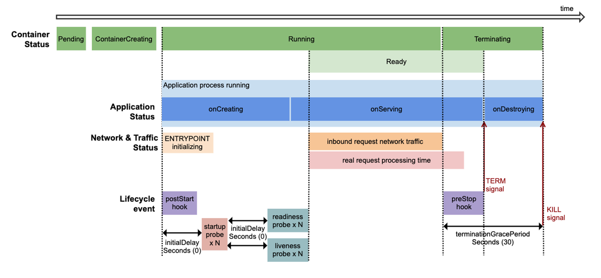
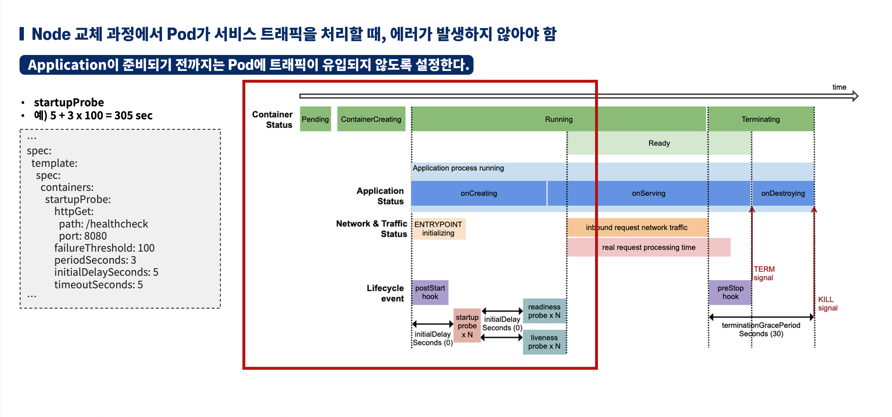
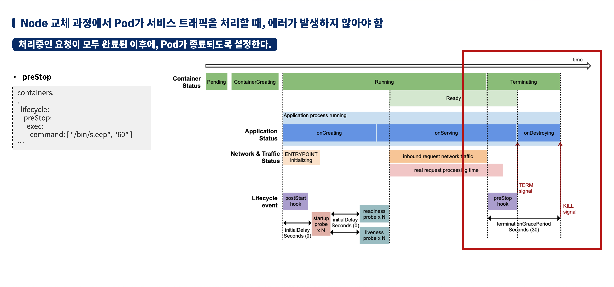
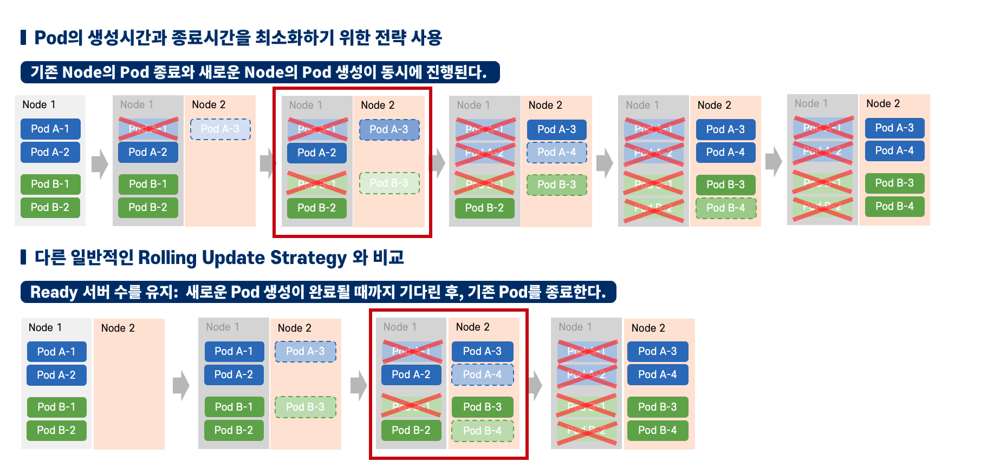
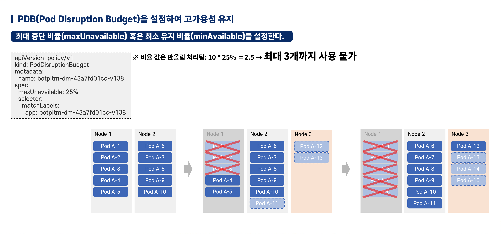
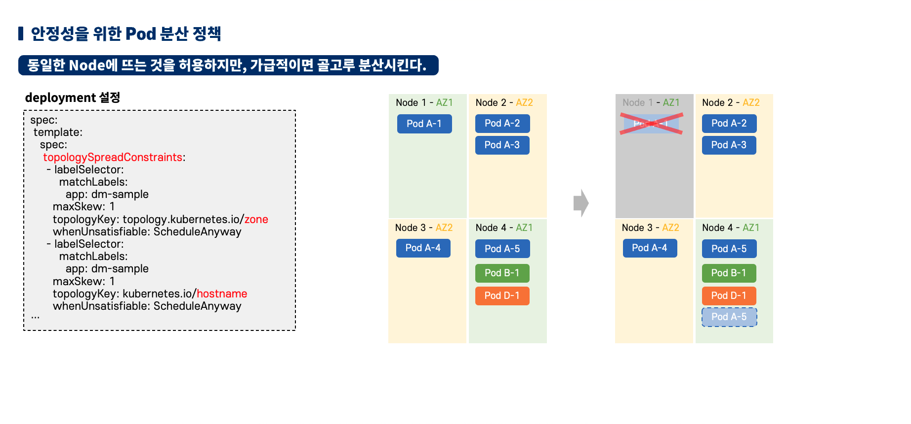
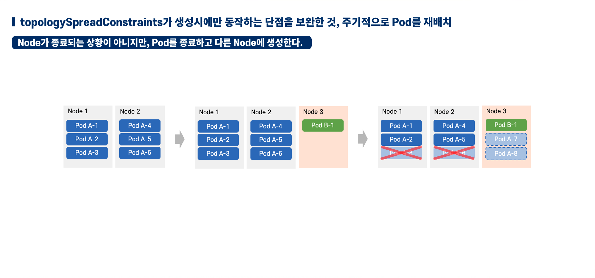
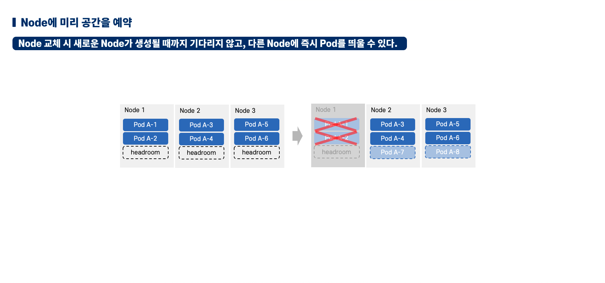
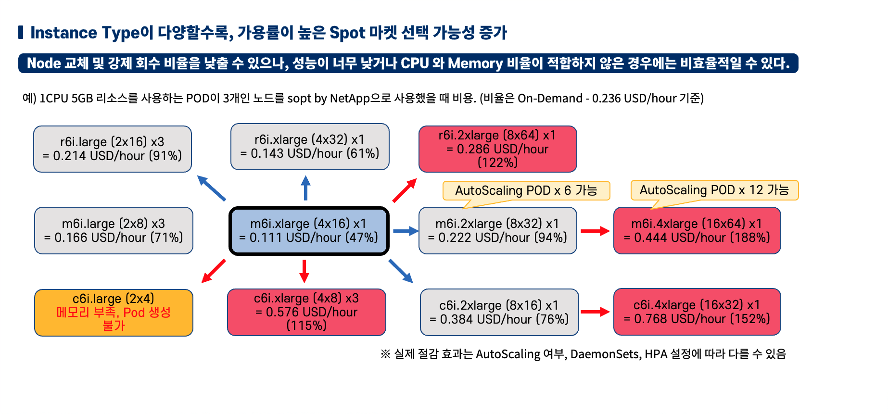
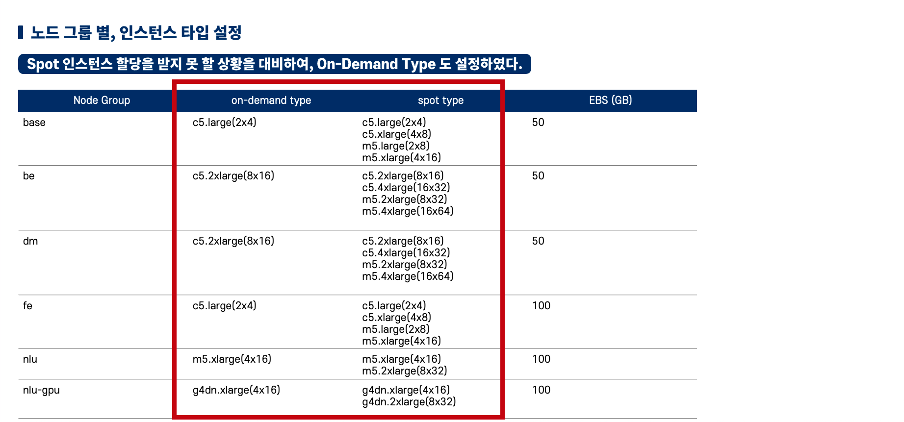

최근 트렌드에 따라 많은 서비스들이 온프레미스 환경에서 클라우드 환경으로 전환을 진행하고 있습니다. 
하지만 전환 이후 예상보다 높은 운영 비용이 발생하는 케이스가 있고, 이러한 경우 각 서비스에 맞는 비용 최적화 과정이 필요합니다. 
저희 팀 역시 운영중이던 챗봇 서비스(RB Dialog, https://www.rbdialog.co.kr )를 온프레미스 환경에서 AWS 클라우드로 전환하였으나, 예상보다 높은 운영 비용으로 인하여 비용 최적화가 필요한 상태였습니다. 이를 위해서 사내 클라우드 엔지니어링 팀을 통해 추천받은 Spot by NetApp 솔루션을 도입하게 되었고, 성공적으로 비용 최적화를 진행하였습니다. 
일반적인 비용 최적화 솔루션들 과 다르게, Spot by NetApp은 SLA(Service Level Agreement)를 보장해 주고 있어 안정성이 보장되어야 하는 서비스들에도 적용이 가능합니다. 
또한 Spot by NetApp 솔루션은 AWS를 포함한 다양한 클라우드 환경에서 운영 비용 최적화를 지원하고 있습니다. 이번 포스팅에서는 Spot by NetApp 솔루션에 대한 간략한 소개와 더불어 저희 팀이 AWS EKS 환경에서 적용한 사례를 중점으로 설명드리고자 합니다.​

###  Spot by NetApp 소개 

우선 Spot by NetApp의 강점을 이해하기 위해서, AWS 인스턴스의 요금제 유형에 대해 살펴볼 필요가 있습니다. AWS 인스턴스 요금제는 크게 On-Demand, RI, Spot으로 분류할 수 있습니다.

* On-Demand 인스턴스는 할인없이 사용한만큼 비용을 전부 지불해야하기 때문에, 최소한으로 사용하는 것이 좋습니다. 일반적으로 사용량 예측이 불가능하며 높은 안정성이 보장되어야 하는 서비스에 적용할 수 있습니다.
* RI(Reserved Instance)는 On-Demand 인스턴스 대비 약 30 ~ 60% 정도의 할인을 받을 수 있으며, 일정 기간 단위로 계약을 해야합니다. 
일반적으로 사용량이 일정하고 예측 가능한 서비스에 쉽게 적용할 수 있습니다. 하지만 대부분의 서비스들은 정확한 사용량 예측이 어렵기 때문에, RI를 활용하려면 최대 사용량에 맞추거나 On-Demand 인스턴스와 혼합해서 적용해야  하는 경우가 많습니다.
* Spot 인스턴스는 On-Demand 인스턴스 대비 최대 90% 까지 할인을 받을 수 있으며, Spot 마켓 상황에 따라 다를 수 있지만 보통 가장 높은 할인을 받을 수 있습니다. 
하지만 Spot 인스턴스는 Amazon EC2에서 여유 있는 미사용 서버들을 사용하는 것이기 때문에, 언제든 다시 회수되어 종료될 수 있습니다. 회수 2분 전 알림을 받을 수 있지만 AWS EKS 환경에서 새로운 노드를 띄우는 시간만 보통 2분 이상이 소요되기 때문에, 이러한 갑작스러운 종료 상황을 대처하기가 어렵습니다. 
그렇기 때문에 일반적으로 안정성이 크게 문제되지 않는 테스트나 개발 환경 등에서 활용할 수 있습니다. 또한 최대 90%까지 할인을 받을 수 있지만, 저희 팀의 경우 평균적으로 약 60% 정도의 할인을 받아 사용하고 있습니다. Spot 인스턴스의 할인율은 인스턴스 타입과 시기, 여러 상황에 따라 차이가 발생할 수 있습니다.

일반적으로 클라우드 운영 비용 최적화를 위해서는 Spot 인스턴스와 RI를 최대한 많이 활용하고, On-Demand 인스턴스는 최소한으로 사용하는 것이 좋습니다. 하지만 적절한 비용 최적화를 위해서는 서비스별 여러 특성과 변수들을 고려해야 하기 때문에, 꾸준한 노력과 관리가 필요합니다. 
이렇게 까다로운 비용 최적화 과정에 대한 부담을 Spot by NetApp 솔루션을 통해서 덜어낼 수 있습니다. 
Spot by NetApp의 강점은 높은 할인율을 제공하는 Spot 인스턴스를 사용하면서도 SLA를 보장하여, 운영 환경에서도 무중단으로 서비스가 가능하도록 해준다는 것입니다. 
그렇다면 언제든 종료될 수 있는 Spot 인스턴스의 문제점을 Spot by NetApp은 어떻게 해결하였을까요? 이번에는 Spot by NetApp의 동작 방식에 대해서 살펴보겠습니다.​

Spot by NetApp의 동작 방식을 간단하게 살펴보면, 머신 러닝을 기반으로 Spot 마켓 분석을 진행하고 Spot 인스턴스에 대한 가용률과 중단 시기를 예측합니다. 이러한 예측을 토대로 종료가 될 수 있는 인스턴스를 미리 새로운 인스턴스로 무중단 교체를 진행합니다. 
만약 Spot 마켓에서 Spot 인스턴스를 받을 수 없는 상황이 발생하게 되면, On-Demand 인스턴스로 전환을 해주어 서비스에 중단이 발생하지 않게 합니다. 대신 이렇게 순단없이 동작하기 위해서는 EKS에서 노드 및 파드가 교체되는 상황에 대한 적절한 조치가 중요합니다.

(Spot by NetApp 솔루션에 대한 보다 자세한 내용은 공식 홈페이지([https://spot.io/](https://spot.io/))와 “Spot By NetApp을 통해 클라우드 컴퓨팅 비용, 최대90% 절감하기”([https://talkit.tv/Event/2603](https://talkit.tv/Event/2603))를 참조하시면 좋을 것 같습니다.)

### 전환 과정

저희 챗봇 서비스에 Spot by NetApp 솔루션을 적용하는 과정은 최종 완료까지 대략 6주 정도의 시간이 소요되었습니다. 
전체적인 전환 과정은 각 환경별로 Spot by NetApp 솔루션을 구성하고, 적용 및 모니터링을 순차적으로 진행하였습니다. 전환 과정에서 필요한 몇 가지 설정만 잘 적용한다면, 어렵지 않게 Spot by NetApp 솔루션을 적용해볼 수 있을 것이라 생각이 됩니다. 
그러면 이제부터 Spot by NetApp 솔루션 적용을 위해 필요한 설정들을 하나씩 살펴보겠습니다.

#### 파드 생성 및 종료 시, 에러 없이 서비스 트래픽을 처리하기 위한 방법
Spot by NetApp 솔루션을 적용하면 노드와 파드가 수시로 교체될 수 있기 때문에, 서비스를 중단없이 안정적으로 운영하기 위해서는 몇 가지 설정이 필요합니다. 
특히 파드 생성과 종료 시점에 애플리케이션이 서비스 트래픽을 에러없이 처리할 수 있어야 합니다. 이것이 가능해야 Spot by NetApp 솔루션을 적용할 수 있고, 더 나아가 오토스케일링 및 무중단 배포 등이 가능합니다. 
이를 위해서 파드 생성과 종료 시점에 에러 없이 트래픽을 서빙할 수 있는 설정 방법에 대해 살펴보겠습니다.

위의 그림을 보시면 초록색으로 표시된 1) 클러스터가 인식하는 파드 상태(Container Status)와 파란색으로 표시된 2) 애플리케이션 상태(Application Status)가 별도로 존재하는 것을 확인하실 수 있습니다. 
클러스터가 인식하는 파드 상태(Container Status)는 크게 Pending, ContainerCreating, Running, Terminating 이 있고, Running 과 Terminating 상태 사이에 실제로 트래픽을 처리할 수 있는 Ready 상태가 있습니다. 애플리케이션 상태(Application Status)는 onCreating, onServing, onDestroying 이 있습니다. 
이러한 2가지 종류의 상태가 있는데 이 상태들이 적절하게 맞물리지 않으면, 트래픽 처리중 에러가 발생할 수 있습니다.

파드가 생성될 때 주로 에러가 발생하는 케이스는, 애플리케이션이 아직 서빙할 준비가 되지 않았는데 준비된 상태로 인식하여 트래픽이 들어오는 경우가 있습니다. 다시 말하면 애플리케이션 상태가 onServing이 아닌데, 파드 상태를 Ready로 인식하여 트래픽이 들어와 에러가 발생하는 경우입니다. 
이를 방지하기 위해서 startupProbe 설정을 세팅하여, 파드 생성 시 애플리케이션이 준비가 된 이후 트래픽이 들어오도록 지연시켜줄 수 있습니다.

반대로 파드가 종료될 때 주로 에러가 발생하는 케이스는 처리중이던 요청을 미처 완료하기 전에 애플리케이션 상태가 종료 상태로 되는 경우입니다. 다시 말하면 처리중이던 요청이 끝나기 전에 애플리케이션의 onDestroying 상태가 완료되는 경우입니다. 이를 방지하기 위해서 preStop 설정을 세팅하여, 파드가 종료될 때 추가적인 트래픽은 차단하고 기존 요청에 대해서 graceful 하게 처리하도록 설정해줄 수 있습니다. 
이처럼 파드 생성 및 종료 시점에 적절한 지연 시간을 설정해준다면, 발생할 수 있는 대부분의 에러 케이스를 방지할 수 있습니다.

### Spot by NetApp의 노드 교체 전략

이제 파드 생성, 종료 시 문제가 없는 상태가 되었다고 가정하고, 노드가 교체될 때 발생할 수 있는 문제들을 살펴보겠습니다. 우선 Spot by NetApp의 노드 교체 방식을 살펴보면, 새로운 노드를 만들고 기존 노드의 파드 종료와 새로운 노드의 파드생성을 동시에 진행하게 됩니다. 
Spot by NetApp의 노드 교체 방식은 Spot 인스턴스에 대한 종료를 미리 예측한 상황에서 교체를 진행하는 것이기 때문에, 최대한 빠르게 노드를 교체하기 위한 전략을 사용합니다. 교체중에도 파드 수를 유지하는 Rolling Update 전략과 비교하였을 때, 상대적으로 안정성이 떨어질 수 있습니다. 
하지만 상대적으로 안정성이 떨어지는 전략을 택한 까닭은 Spot 인스턴스의 문제점인 수 분 내에 노드 종료가 될 수 있는 문제 상황을 극복하기 위함입니다.

Spot by NetApp의 노드 교체 방식을 고려하여, 노드 교체 시 발생할 수 있는 문제점을 개선하기 위한 방법을 알아보겠습니다.

### 노드 교체 안정성 개선 방법

노드 교체 시에 안정성을 개선하기 위한 방법으로 PDB(Pod Disruption Budget)를 설정하는 방법이 있습니다. 
PDB는 파드를 중단시킬 때, 최대 얼마나 중단할지 또는 반대로 최소 얼마나 유지할지를 설정하는 것입니다. 
해당 설정을 하지 않으면, 모든 파드가 한꺼번에 종료되는 상황이 올 수 있기 때문에 필수적으로 설정해야 합니다. 예를 들어 2개의 노드에 5개의 파드가 존재하는 상황, 즉 10개의 파드가 있는 상태에서 최대 중단 비율을 25%로 설정하면, 3개로 반올림되어서 10개 중 3개는 중단을 허용하겠다는 뜻이 됩니다. 
노드가 종료될 때 3개의 파드까지는 그냥 바로 종료되고, 파드 상태가 Ready 인 파드가 7개 미만이 될 것 같으면 더 이상 종료하지 않고 대기했다가 생성되는 상황을 살펴가며 파드 종료를 이어나가게 됩니다. 
만약 중단 비율을 작게 잡으면 트래픽은 많이 처리할 수 있지만 새로운 노드로 파드가 이동하는 데 시간이 오래 걸려 위험하고, 크게 잡으면 트래픽이 많은 경우에는 감당할 수 없는 상태가 될 수 있으므로, 서비스 트래픽 상황에 맞춰서 적절한 비율로 설정해야 합니다.

다음 방법 podAntiAffinity는 파드가 동일한 노드에 뜨지 않도록 하는 설정하는 방법입니다. 
파드가 이중화 되어있는 상황을 사례로 하였을 때, 안정성을 위해 2개의 파드가 서로 다른 노드에 퍼져 있어야 합니다. 만일 하나의 노드에 2개의 파드가 떠있다면, 단 하나의 노드만 종료되어도 서비스 장애가 발생할 수 있습니다. 이 설정을 통해서 파드가 여러 노드에 분산되서 실행될 수 있도록 처리할 수 있습니다. 
예를 들어 2개의 파드가 2개의 노드에 각각 1개씩 올라가 있는 상태에서, 한 노드가 종료되면 다른 노드에 CPU, 메모리 자원이 충분하더라도 새로운 노드를 생성해서 파드를 실행하게 됩니다.

다음 방법은 토폴로지 분산 정책(topologySpreadConstraints)입니다. 
파드가 동일 노드에 뜨는 것을 허용하긴 하지만, 가급적이면 분산시켜야 하는 경우에 사용합니다. 이 설정을 통해서 여러 존과 노드에 파드가 분산되도록 설정해주면, 서비스가 안정적으로 운영되는데 도움을 줄 수 있습니다. 예를 들어 서로 다른 존에 여러 개의 노드가 있고 파드가 분산되어 있는 상황을 가정했을 때, 개별적인 노드에서 장애가 발생할 수도 있지만 네트워크 장애 등의 사유로 존별로 장애가 발생하는 케이스도 있을 수 있습니다. 별다른 설정이 존재하지 않는다면 한 노드가 종료되었을 때 가장 많이 비어있는 노드에 파드가 실행되게 되는데, 이렇게 되면 특정 노드에 파드가 집중되는 문제가 발생할 수 있습니다.

다음 방법으로 디스케줄러(Descheduler) 설정은 별도 서비스를 설치해야 적용할 수 있는 방법입니다. 
앞서 말씀드린 토폴로지 분산 정책에 대한 단점을 보완할 수 있는 방법이기도 합니다. 토폴로지 분산 정책은 파드 생성 시에만 동작하고 그 이후에는 동작하지 않는 문제가 있습니다. 쿠버네티스 공식 문서에서 해당 문제를 보완하기 위해 해당 설정 사용을 가이드하고 있습니다.

다음은 Headroom 설정 입니다. 
이 설정은 Spot by NetApp에서 설정할 수 있으며, 노드에 파드 공간을 미리 예약해서 노드 교체 시 새로운 노드가 생성될 때까지 기다리지 않고 빠르게 파드를 띄울 수 있는 설정입니다. 
다만 너무 많은 공간을 예약할 시, 리소스가 낭비될 수 있다는 문제점이 있습니다.

마지막으로 노드 안정성을 개선하기 위한 방법으로, 가능하면 많은 인스턴스 타입을 지정해서 가용률이 높은 Spot 마켓을 선택하도록 할 수 있습니다. 
각 서비스 별로 성격에 맞는 인스턴스를 지정해야 안정성을 높이는데 도움을 줄 수 있습니다. 예를 들어 m6i.xlarge 를 기준으로 Spot 인스턴스를 사용하면 47% 비용으로 사용할 수 있다고 가정했을 때, 두단계 이상 높은 등급으로 사용하면 On-Demand 인스턴스 가격보다 오히려 높아져서 손해가 발생할 수가 있고, 크기가 작은 인스턴스를 지정하면 리소스 크기가 맞지 않아 서버를 더 띄워야 하는 경우가 발생하거나 아예 파드가 생성되지 못하는 케이스가 발생할 수도 있습니다.

최종적으로 Spot by NetApp의 인스턴스를 설정 할 때, Spot 인스턴스로 사용할 인스턴스 후보들을 이렇게 여러 개 설정할 수 있습니다. 또한 Spot 인스턴스를 할당 받지 못해서 On-Demand 인스턴스를 사용해야하는 경우도 고려해야 하기 때문에, On-Demand 인스턴스 타입도 추가로 설정을 해주어야 합니다.

### 테스트 참조사항

Spot by NetApp 솔루션 적용 과정에서, nGrinder와 같은 부하테스트 툴을 활용하여 노드 및 파드가 교체될 때 애플리케이션이 에러없이 서비스 트래픽을 잘 처리하는지 테스트를 진행하는 것이 좋습니다. 
저희는 Spot by NetApp을 적용할 때 AWS Cloud9에 nGrinder를 설치하여, 부하테스트를 진행하면서 트래픽이 정상적으로 잘 처리되는지 모니터링하였습니다.

또한 Spot 마켓 상황이 변경되어서 노드가 교체되는 상황에 대한 테스트를 실제로 진행하기가 어렵기 때문에, 유사한 상황을 재현하기 위해서 On-Demand 인스턴스 노드를 Spot 인스턴스 노드로 전환하는 작업을 하면서 테스트 및 모니터링을 진행하였습니다.

### 전환 결과 및 마무리

Spot by NetApp 솔루션 라이센스 비용은 계약에 따라 다를 수 있지만, 절감된 비용의 일부분만을 수수료로 지불하면 됩니다. 구체적인 수수료 비율에 대해 공개해드릴 수는 없지만, 수수료를 포함하더라도 충분히 많은 비용을 절감할 수 있었습니다. 
저희 서비스에 Spot by NetApp 솔루션 적용 전후 클라우드 운영 비용을 비교해보면, 수수료를 포함해서 약 40% 정도 절감할 수 있었습니다.

저희는 Spot by NetApp 솔루션 적용 과정에서 그동안 진행하였던 모니터링 데이터를 토대로 인스턴스 최적화 작업도 함께 진행하였습니다. 운영 비용 최적화 솔루션 도입 전에 모니터링을 통하여 각 서비스별 특징을 잘 파악하고, 적절한 인스턴스 타입을 적용하는 것만으로도 어느 정도의 운영 비용 절감을 해낼 수 있습니다.

클라우드 전환 트렌드에 따라 많은 서비스들이 온프레미스 환경에서 클라우드 환경으로 전환을 하였지만, 부담스러운 클라우드 운영 비용으로 인하여 온프레미스 환경으로 회귀를 고려하고 있는 케이스가 생겨나고 있습니다. 
하지만 클라우드 환경에서 누릴 수 있는 확장성, 유연성, 고가용성, 인프라 유지보수 용이성 등과 같은 여러 장점들을 포기하기가 쉽지 않습니다. 
만약 운영중인 서비스에 대해서 클라우드 운영 비용 최적화를 고려하고 있다면, 저희와 같이 Spot by NetApp 솔루션 적용을 검토해보시는 것도 좋을 것 같습니다.

감사합니다.
